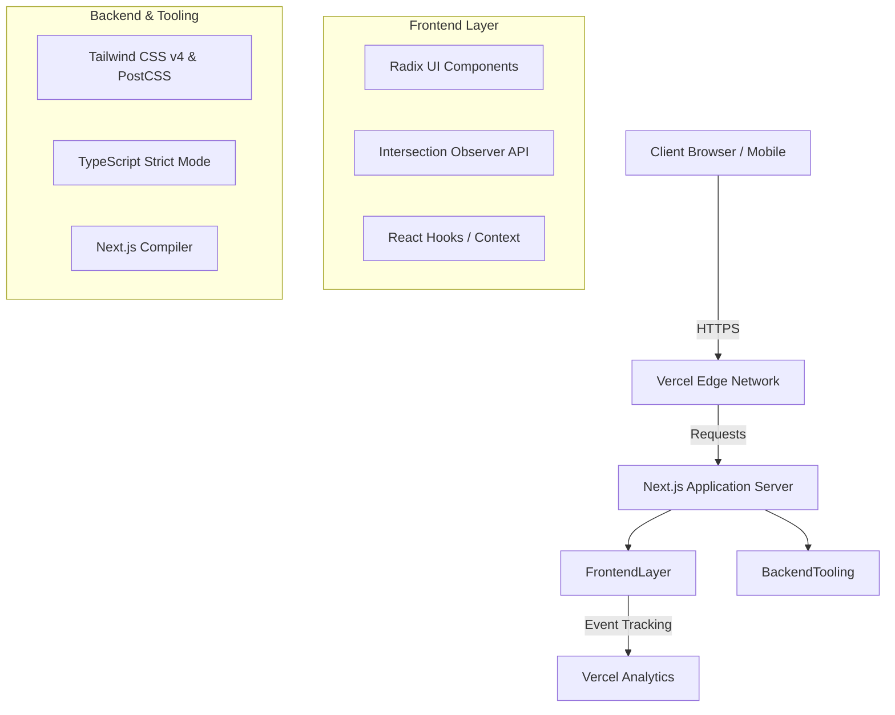

<div align="center">

<h1 align="center" style="color: #FF1493;"><b>MEENA DEV PORTFOLIO</b></h1>
<p align="center" style="color: #FF1493;"><b>A High-Performance, Interactive Developer Portfolio Engineered with Next.js</b></p>

[](#)
[](#)
[](#)
[](#)

</div>

<br/>

## <span style="color: #FF1493;">Overview</span>

The <span style="color: #FF1493;">**Meena Dev**</span> Portfolio is a modern, interactive, and visually striking personal developer portfolio designed to showcase <span style="color: #FF1493;">**MERN stack**</span> expertise. Built on top of <span style="color: #FF1493;">**Next.js 16**</span> and <span style="color: #FF1493;">**React 19**</span>, it incorporates custom WebGL-style cursor tracking, parallax scrolling, and viewport-triggered animations. It serves as a centralized hub for archiving enterprise-grade applications, technical articles, and professional history.

<br/>

## <span style="color: #FF1493;">System Architecture</span>



<br/>

## <span style="color: #FF1493;">Features</span>

### <span style="color: #FF1493;">Core Capabilities</span>
* <span style="color: #FF1493;">**Dynamic Project Showcase:**</span> A structured archive section systematically mapping out high-level MERN stack projects.
* <span style="color: #FF1493;">**Radix UI Integration:**</span> Fully accessible, keyboard-friendly UI primitives integrated via custom components.
* <span style="color: #FF1493;">**Responsive Architecture:**</span> Adaptive tracking algorithms enabling perfect scaling from ultra-wide displays to mobile devices.

### <span style="color: #FF1493;">Visual & UI/UX Innovations</span>
* <span style="color: #FF1493;">**Custom Cursor Tracking:**</span> A persistent, physics-based follower element that reacts dynamically to the user's cursor.
* <span style="color: #FF1493;">**Proximity Hover Effects:**</span> Interactive text elements engineered to react to cursor proximity using bounding client rectangle geometry.
* <span style="color: #FF1493;">**Scroll-Triggered Parallax:**</span> Smooth hero image displacement anchored programmatically to raw window scroll coordinates.
* <span style="color: #FF1493;">**Intersection-based Reveal:**</span> Clean, staggered sequential fade-ins for typography as nodes intercept the active viewport.

### <span style="color: #FF1493;">Security Features</span>
* <span style="color: #FF1493;">**Dependency Lock-in:**</span> Strict dependency resolution maps via `pnpm-lock.yaml` mitigating supply chain interference.
* <span style="color: #FF1493;">**Client-side Defenses:**</span> Total reliance on React's automatic XSS escaping during the rendering cycle.

### <span style="color: #FF1493;">Performance Features</span>
* <span style="color: #FF1493;">**Asset Optimization:**</span> Native `postcss` image and font compilation executed during build-time.
* <span style="color: #FF1493;">**Event Listener Delegation:**</span> Centralized `useEffect` cleanups executing strict garbage collection for physics and window observers.
* <span style="color: #FF1493;">**Zero CSS-in-JS:**</span> Pure CSS and native Tailwind execution utilized to eradicate runtime style injection costs.

<br/>

## <span style="color: #FF1493;">Tech Stack</span>

### <span style="color: #FF1493;">Frontend</span>
*  <span style="color: #FF1493;">**Next.js 16**</span> - Application Framework
*  <span style="color: #FF1493;">**React 19**</span> - UI Library
*  <span style="color: #FF1493;">**Tailwind CSS v4**</span> - Utility-first Styling
*  <span style="color: #FF1493;">**Radix UI**</span> - Headless Component Primitives

### <span style="color: #FF1493;">Backend</span>
*  <span style="color: #FF1493;">**Node.js**</span> - Server Environment

### <span style="color: #FF1493;">DevOps</span>
*  <span style="color: #FF1493;">**Vercel**</span> - Hosting and CI/CD
*  <span style="color: #FF1493;">**Git**</span> - Version Control Strategy

### <span style="color: #FF1493;">Security</span>
*  <span style="color: #FF1493;">**Dependabot**</span> - Automated Vulnerability Patching 
*  <span style="color: #FF1493;">**ESLint**</span> - Static Code Analysis

<br/>

## <span style="color: #FF1493;">Installation Guide</span>

### <span style="color: #FF1493;">Prerequisites</span>
* <span style="color: #FF1493;">Node.js</span> v22.x or later
* <span style="color: #FF1493;">Git</span>
* <span style="color: #FF1493;">PNPM</span> (Recommended)

### <span style="color: #FF1493;">Local Environment Setup</span>

```bash
# Clone the repository locally
git clone https://github.com/BYTEGUARDIAN14/meenuu-portfolio.git
cd meenuu-portfolio

# Install application dependencies
pnpm install

# Initialize development compilation server
pnpm run dev
```

<br/>

## <span style="color: #FF1493;">Usage</span>

The application is engineered as a static-first <span style="color: #FF1493;">**Next.js**</span> portfolio. All architectural data rendering occurs directly via mapping functions in the core component tree.

### <span style="color: #FF1493;">UI Configuration Modifications</span>
To alter physics limits for the interactive cursor layer, navigate to the `app/page.tsx` lifecycle methods:
```typescript
// Adjust threshold bounds for proximity magnetization
const distance = Math.sqrt(
  Math.pow(x - (rect.left + rect.width / 2), 2) + Math.pow(y - (rect.top + rect.height / 2), 2)
)
if (distance < 100) { // <-- Modifier threshold 
  element.classList.add("near-cursor")
}
```

<br/>

## <span style="color: #FF1493;">Visuals</span>

<table width="100%">
  <tr>
    <td align="center" width="33%">
      
      <br>
      <i><span style="color: #FF1493;">Hero Section with Interactive MERN Stack typography.</span></i>
    </td>
    <td align="center" width="33%">
      
      <br>
      <i><span style="color: #FF1493;">Custom physics-based WebGL cursor blob demonstration.</span></i>
    </td>
    <td align="center" width="33%">
      
      <br>
      <i><span style="color: #FF1493;">Responsive project cards with scroll-reveal mechanics.</span></i>
    </td>
  </tr>
</table>

<br/>

## <span style="color: #FF1493;">API Documentation</span>

The current iteration operates strictly with <span style="color: #FF1493;">**Next.js Server Side Rendering (SSR)**</span> without exposing public API endpoints.
If Headless CMS integration is required, Route Handlers should be deployed within an `app/api/` structure intercepting `GET` queries.

<br/>

## <span style="color: #FF1493;">Security Considerations</span>

Implementation protocols mandated for this continuous delivery ecosystem include:
* <span style="color: #FF1493;">**Content Security Policy (CSP):**</span> Header propagation blocking unverified schema executions via `next.config.mjs`.
* <span style="color: #FF1493;">**Sanitized DOM Traversal:**</span> TypeScript interfaces verifying that string interpolations are shielded before layout paints.
* <span style="color: #FF1493;">**Secrets Compartmentalization:**</span> Encrypting CI keys and isolating `.env.local` strictly from git indexes.
* <span style="color: #FF1493;">**Component Abstraction Safety:**</span> Ensuring Radix UI handlers prevent common prototype pollution vectors during DOM mutations.

<br/>

## <span style="color: #FF1493;">Performance & Scalability</span>

* <span style="color: #FF1493;">**Layout Handling Integration:**</span> CSS rules orchestrate fluid element widths avoiding Cumulative Layout Shifts (CLS).
* <span style="color: #FF1493;">**Asynchronous Threading:**</span> Intersection Observers delegate render queues out of critical synchronous pathways.
* <span style="color: #FF1493;">**CDN Edge Delivery:**</span> Pre-rendered HTML aggregates are propagated across global nodes bypassing runtime computations for optimal Time To First Byte (TTFB).

<br/>

## <span style="color: #FF1493;">Contribution Guide</span>

Engineering pull requests must adhere to rigorous quality gates.
1. Fork the codebase to your secure namespace.
2. Initialize an isolated feature branch using syntax: `feat/component-name` or `fix/issue-description`.
3. Standardize code formats by running local compilation rules: `npm run lint`.
4. Package atomic commits featuring semantic syntax prefixes.
5. Deploy a cross-branch Pull Request targeting the primary `main` trajectory.

<br/>

## <span style="color: #FF1493;">License</span>

This architecture is released under the standard <span style="color: #FF1493;">**MIT License**</span>. Operations, derivatives, and commercial integration are universally permitted.

<div align="center">
  <hr style="border: 1px solid #FF1493;">
  <i style="color: #FF1493;">Engineered for scale. Compiled for performance. Styled in <b>Pink</b>.</i>
</div>
