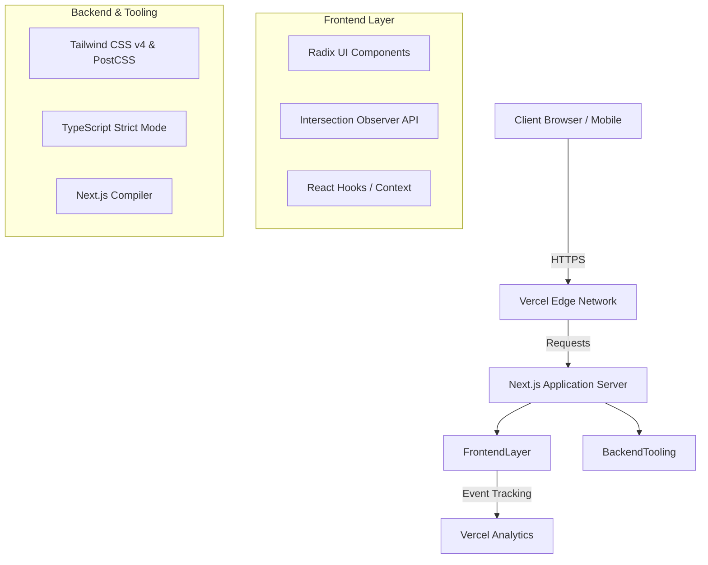

<div align="center">

# <h1 style="color: #FF1493;"><b>MEENA DEV PORTFOLIO</b></h1>
**A High-Performance, Interactive Developer Portfolio Engineered with Next.js**

[](#)
[](#)
[](#)
[](#)

</div>

<br/>

## <span style="color: #FF1493;">Overview</span>

The Meena Dev Portfolio is a modern, interactive, and visually striking personal developer portfolio designed to showcase MERN stack expertise. Built on top of **Next.js 16** and **React 19**, it incorporates custom WebGL-style cursor tracking, parallax scrolling, and viewport-triggered animations. It serves as a centralized hub for archiving enterprise-grade applications, technical articles, and professional history.

<br/>

## <span style="color: #FF1493;">System Architecture</span>



<br/>

## <span style="color: #FF1493;">Features</span>

### Core Capabilities
* **Dynamic Project Showcase:** A structured archive section systematically mapping out high-level MERN stack projects.
* **Radix UI Integration:** Fully accessible, keyboard-friendly UI primitives integrated via custom components.
* **Responsive Architecture:** Adaptive tracking algorithms enabling perfect scaling from ultra-wide displays to mobile devices.

### Visual & UI/UX Innovations
* **<span style="color: #FF1493;">Custom Cursor Tracking:</span>** A persistent, physics-based follower element that reacts dynamically to the user's cursor.
* **Proximity Hover Effects:** Interactive text elements engineered to react to cursor proximity using bounding client rectangle geometry.
* **Scroll-Triggered Parallax:** Smooth hero image displacement anchored programmatically to raw window scroll coordinates.
* **Intersection-based Reveal:** Clean, staggered sequential fade-ins for typography as nodes intercept the active viewport.

### Security Features
* **Dependency Lock-in:** Strict dependency resolution maps via `pnpm-lock.yaml` mitigating supply chain interference.
* **Client-side Defenses:** Total reliance on React's automatic XSS escaping during the rendering cycle.

### Performance Features
* **Asset Optimization:** Native `postcss` image and font compilation executed during build-time.
* **Event Listener Delegation:** Centralized `useEffect` cleanups executing strict garbage collection for physics and window observers.
* **Zero CSS-in-JS:** Pure CSS and native Tailwind execution utilized to eradicate runtime style injection costs.

<br/>

## <span style="color: #FF1493;">Tech Stack</span>

### Frontend
*  **Next.js 16** - Application Framework
*  **React 19** - UI Library
*  **Tailwind CSS v4** - Utility-first Styling
*  **Radix UI** - Headless Component Primitives

### Backend
*  **Node.js** - Server Environment

### DevOps
*  **Vercel** - Hosting and CI/CD
*  **Git** - Version Control Strategy

### Security
*  **Dependabot** - Automated Vulnerability Patching 
*  **ESLint** - Static Code Analysis

<br/>

## <span style="color: #FF1493;">Installation Guide</span>

### Prerequisites
* Node.js v22.x or later
* Git
* PNPM (Recommended)

### Local Environment Setup

```bash
# Clone the repository locally
git clone https://github.com/BYTEGUARDIAN14/meenuu-portfolio.git
cd meenuu-portfolio

# Install application dependencies
pnpm install

# Initialize development compilation server
pnpm run dev
```

<br/>

## <span style="color: #FF1493;">Usage</span>

The application is engineered as a static-first Next.js portfolio. All architectural data rendering occurs directly via mapping functions in the core component tree.

### UI Configuration Modifications
To alter physics limits for the interactive cursor layer, navigate to the `app/page.tsx` lifecycle methods:
```typescript
// Adjust threshold bounds for proximity magnetization
const distance = Math.sqrt(
  Math.pow(x - (rect.left + rect.width / 2), 2) + Math.pow(y - (rect.top + rect.height / 2), 2)
)
if (distance < 100) { // <-- Modifier threshold 
  element.classList.add("near-cursor")
}
```

<br/>

## <span style="color: #FF1493;">Visuals</span>

<table width="100%">
  <tr>
    <td align="center" width="33%">
      
      <br>
      <i>Hero Section with Interactive MERN Stack typography.</i>
    </td>
    <td align="center" width="33%">
      
      <br>
      <i>Custom physics-based WebGL cursor blob demonstration.</i>
    </td>
    <td align="center" width="33%">
      
      <br>
      <i>Responsive project cards with scroll-reveal mechanics.</i>
    </td>
  </tr>
</table>

<br/>

## <span style="color: #FF1493;">API Documentation</span>

The current iteration operates strictly with Next.js Server Side Rendering (SSR) without exposing public API endpoints.
If Headless CMS integration is required, Route Handlers should be deployed within an `app/api/` structure intercepting `GET` queries.

<br/>

## <span style="color: #FF1493;">Security Considerations</span>

Implementation protocols mandated for this continuous delivery ecosystem include:
* **Content Security Policy (CSP):** Header propagation blocking unverified schema executions via `next.config.mjs`.
* **Sanitized DOM Traversal:** TypeScript interfaces verifying that string interpolations are shielded before layout paints.
* **Secrets Compartmentalization:** Encrypting CI keys and isolating `.env.local` strictly from git indexes.
* **Component Abstraction Safety:** Ensuring `Radix UI` handlers prevent common prototype pollution vectors during DOM mutations.

<br/>

## <span style="color: #FF1493;">Performance & Scalability</span>

* **Layout Handling Integration:** CSS rules orchestrate fluid element widths avoiding Cumulative Layout Shifts (CLS).
* **Asynchronous Threading:** Intersection Observers delegate render queues out of critical synchronous pathways.
* **CDN Edge Delivery:** Pre-rendered HTML aggregates are propagated across global nodes bypassing runtime computations for optimal Time To First Byte (TTFB).

<br/>

## <span style="color: #FF1493;">Contribution Guide</span>

Engineering pull requests must adhere to rigorous quality gates.
1. Fork the codebase to your secure namespace.
2. Initialize an isolated feature branch using syntax: `feat/component-name` or `fix/issue-description`.
3. Standardize code formats by running local compilation rules: `npm run lint`.
4. Package atomic commits featuring semantic syntax prefixes.
5. Deploy a cross-branch Pull Request targeting the primary `main` trajectory.

<br/>

## <span style="color: #FF1493;">License</span>

This architecture is released under the standard **MIT License**. Operations, derivatives, and commercial integration are universally permitted.

<div align="center">
  <hr>
  <i>Engineered for scale. Compiled for performance.</i>
</div>
